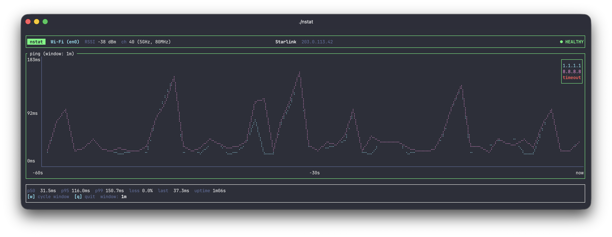

# nstat

A terminal network-health monitor you can leave open during meetings. Shows current latency, packet loss, WiFi info, and a sliding-window line chart so you can spot trouble *before* a meeting falls apart.



## What it does

- Pings `1.1.1.1` and `8.8.8.8` once per second over **unprivileged ICMP** (no `sudo` required)
- Falls back to an HTTP probe against `captive.apple.com` when ICMP starts failing — distinguishes "this network blocks ICMP" from "actually offline"
- Renders a line chart of latency with selectable windows (1m / 10m / 1h)
- Shows aggregate stats: p50 / p95 / p99, packet loss %, uptime
- Surfaces the active WiFi interface, SSID, RSSI, channel, PHY mode
- Classifies overall health (Healthy / Degraded / Bad / ICMP-blocked / Offline) and reflects it in colors across the header, chart border, and badge

History is in-memory and session-only.

## Run

```sh
cargo run --release
# or, after building:
./target/release/nstat
```

### Custom targets

```sh
nstat                                 # defaults: 1.1.1.1 and 8.8.8.8
nstat 9.9.9.9                         # single IP
nstat 1.1.1.1 8.8.8.8 9.9.9.9         # multiple
nstat one.one.one.one google.com      # hostnames (resolved at startup)
```

Each target gets its own color in the 1m line chart. The 10m/1h bar charts show worst-case RTT across all targets per time bucket.

### Keys

| Key | Action |
|-----|--------|
| `w` | cycle time window (1m → 10m → 1h) |
| `q` / `Esc` / `Ctrl-C` | quit |

### Other modes

```sh
nstat --check                # probe for ~8s, print summary, exit
nstat --check 9.9.9.9        # same, but against custom targets
nstat --help                 # usage
```

`--check` is a quick way to verify connectivity and the WiFi probe before relying on the TUI in a meeting.

## Logs

`~/Library/Logs/nstat/nstat.log`. Bump verbosity with `NSTAT_LOG=nstat=debug`.

## macOS privacy notes

- **SSID/BSSID may show as `(grant Location to terminal)`** because macOS 15+ redacts them for any process whose parent app doesn't have Location Services access. nstat itself can't prompt — the permission attaches to the terminal app you launched it from. To unredact:
  1. **System Settings → Privacy & Security → Location Services** → toggle on for your terminal (Terminal.app, iTerm, Ghostty, Alacritty, etc.).
  2. If your terminal isn't in the list, run nstat once first so macOS registers the request, then re-check.
  3. Quit and relaunch the terminal — the permission only applies to newly-started processes.
  4. Run nstat again. WiFi metadata refreshes every 30s, so it may take that long for the redacted hint to clear.
  
  If you're inside `tmux`/`screen` or SSH'd in, the permission attaches to whichever process is the parent — start a fresh session after granting.
- `system_profiler SPAirPortDataType` takes ~7 seconds to return on recent macOS, so WiFi metadata refreshes every 30s and may show stale signal strength briefly after launch.

## Health thresholds (trailing 30s)

| State | Color | Condition |
|-------|-------|-----------|
| Healthy | green | loss == 0 AND p95 < 100 ms |
| Degraded | yellow | anything between Healthy and Bad |
| Bad | red | loss ≥ 10% OR p95 ≥ 300 ms |
| ICMP-blocked | magenta | ≥ 5 consecutive ICMP timeouts but HTTP fallback succeeds |
| Offline | bright red | ICMP and HTTP both failing |
